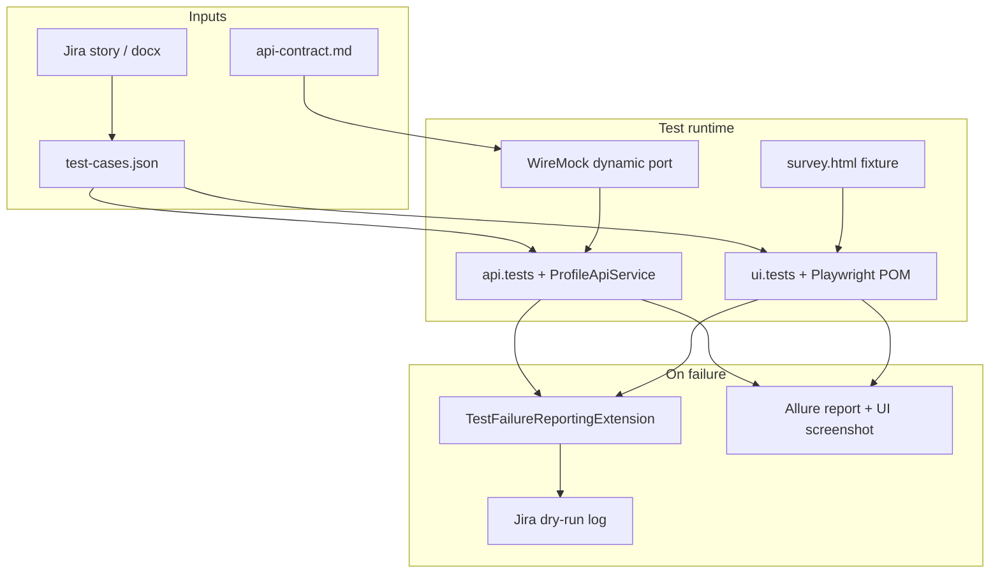

# TestProject — AI-Driven Automation Challenge

Mock POC for the profile interest survey: **API-first** tests (WireMock), **UI logic** tests (Playwright + POM), and an **AI-assisted** workflow (prompts, dry-run Jira, Allure).

Related docs: [PROMPTS.md](PROMPTS.md), [AI-STRATEGY.md](AI-STRATEGY.md), [docs/test-cases.json](docs/test-cases.json), [docs/api-contract.md](docs/api-contract.md), [docs/ui-layer.md](docs/ui-layer.md), [docs/mcp-setup.md](docs/mcp-setup.md).

---

## Architecture overview



| Layer | Technology | Role |
|-------|------------|------|
| API | Spring + WireMock + Rest Assured | Mock backend; `ProfileApiService` |
| UI | Playwright + `ui.pom` | Business logic on local HTML fixture |
| Reporting | `helpers` + Allure | Fail → LLM stub → Jira JSON (dry-run); HTML report |
| Config | `application.properties`, Gradle | Tags, headless, `jira.dryRun`, `reporting.onFailure` |

Stack follows flat packages (like SimpleTestproject): `api.tests`, `ui.tests`, `configs`, `helpers` — not `com.teamrotator.qa.*`.

### Packages

| Package | Role |
|---------|------|
| `common` | `Constants` (HTTP codes, tags, survey rules, API paths) |
| `configs` | `ApiProperties` (WireMock base URL) |
| `api` | Spring config, `RestClient`, `WireMockStubs`, `RequestSpecProvider` |
| `api.models` | `VodPreferencesPayload` |
| `api.services` | `ProfileApiService` |
| `api.tests` | `BaseApiTest`, API test classes |
| `ui.config` | `UiProperties` |
| `ui.driver` | `PlaywrightFactory` (ThreadLocal per parallel test) |
| `ui.pom` | `SurveyStepPage`, `MoviesStepPage` |
| `ui.tests` | `BaseUiTest`, `SurveyFlowUiTest` |
| `helpers` | `TestFailureReportingExtension`, Jira/LLM dry-run |
| `utils` | `FixtureUtils` |

---

## AI workflow (TZ stages 1–3)

| Stage | Goal | Artifacts | How to run in Cursor |
|-------|------|-----------|----------------------|
| **1** | Test cases from AC | `docs/test-cases.json` | [prompts/jira-ac-to-testcases.md](prompts/jira-ac-to-testcases.md) + Jira MCP ([mcp-setup](docs/mcp-setup.md)) |
| **2** | Automate API + UI | Java tests, WireMock, POM | [prompts/jira-ac-to-java-tests.md](prompts/jira-ac-to-java-tests.md) |
| **3** | Fail → bug report | `helpers/*`, prompts | Auto: `TestFailureReportingExtension`; manual: [test-failure-to-jira-bug.md](prompts/test-failure-to-jira-bug.md) |

End-to-end flow:

1. Read Jira issue (MCP) or paste User Story → update `test-cases.json`.
2. Generate/update tests from JSON + `api-contract.md` (human review required).
3. `./gradlew regressionTest` (or `apiTest` / `uiTest`).
4. On failure: extension logs `JIRA_DRY_RUN` JSON; optional MCP to create a real Bug; Allure shows screenshot for UI.

Prompt log and AI mistakes: [PROMPTS.md](PROMPTS.md). Scaling to ads: [AI-STRATEGY.md](AI-STRATEGY.md).

---

## Traceability (Jira → tests → report)

| Source | Field | In code / report |
|--------|-------|------------------|
| `test-cases.json` | `jiraKey` | Allure `@Epic("LOCAL-SURVEY")` on base tests |
| `test-cases.json` | `layer` | Allure `@Feature("api")` / `"ui"` |
| `test-cases.json` | `acRef` | Allure `@Story("AC-2")` etc. |
| `test-cases.json` | `id` | `@Description("testCaseId: …")`, `@DisplayName` |
| `test-cases.json` | `notes` | Maps case id → test method name |

---

## POC limitations

| Topic | In POC | Not covered |
|-------|--------|-------------|
| Backend | WireMock only | Real services / DB |
| UI | `fixtures/survey.html` | Real app, profile creation (AC-1) |
| Jira | Dry-run log by default | Live issue create (see `.env.example`) |
| LLM | Stub summaries | Live OpenAI |
| UI scope | Enabled/disabled, steps, skip | Layout, colors, positions |

---

## Run tests

```bash
export JAVA_HOME=$(/usr/libexec/java_home -v 17)
```

API only:

```bash
./gradlew apiTest
```

UI (Playwright):

```bash
./gradlew playwrightInstall uiTest
```

Other suites:

```bash
./gradlew layeredTest --parallel
./gradlew smokeTest
./gradlew regressionTest
```

### Allure

Generate report (output dir is cleaned automatically before each run):

```bash
./gradlew regressionTest allureReport
```

Serve in browser:

```bash
./gradlew allureServe
```

Static HTML (no server): open `build/reports/allure-report/allureReport/index.html` in a browser.

### Reporting on failure

Enabled by default (`reporting.onFailure=true`). Parses `LOCAL-SURVEY-TC-*` from `@DisplayName`, logs Jira issue JSON (dry-run).

```bash
./gradlew test -Dreporting.onFailure=false
```

See [docs/ai-jira-integration.md](docs/ai-jira-integration.md).

---

## CI (GitHub Actions)

Workflow [`.github/workflows/tests.yml`](.github/workflows/tests.yml) runs tests on `ubuntu-latest` with Java 17.

**Automatic (push / PR to `main`):** runs `apiTest` only (fast gate, no Playwright).

**Manual:** Actions → **Tests** → **Run workflow** → choose **suite**:

| Suite | Gradle task |
|-------|-------------|
| `api` | `apiTest` |
| `ui` | `uiTest` |
| `smoke` | `smokeTest` |
| `regression` | `regressionTest` |
| `all` | `test` |

Results appear under **Checks** as JUnit summary (not Allure HTML). On failure, inspect logs in the workflow run; for steps, attachments, and traceability run Allure locally:

```bash
./gradlew regressionTest allureReport
./gradlew allureServe
```

CI sets `-Dreporting.onFailure=false` to avoid Jira dry-run noise in logs.

---

## Tags (`Constants.Tags`)

- Layers: `api`, `ui`, `reporting`
- Suites: `smoke`, `regression`

Use `Constants.Http.OK`, `Constants.Http.BAD_REQUEST`, `Constants.Http.NOT_FOUND` in API assertions.

---

## UI layer

- Class: `ui.tests.SurveyFlowUiTest` — flat `@Test` methods; each calls `openSurvey()`.
- Parallel: JUnit concurrent + `PlaywrightFactory` ThreadLocal.
- Headless default; debug: `./gradlew uiTest -Dui.headless=false`

Details: [docs/ui-layer.md](docs/ui-layer.md).

---

## Troubleshooting — Playwright on macOS

If UI tests fail at browser launch with `TargetClosedError` or `SEGV_ACCERR`:

1. Java 17: `export JAVA_HOME=$(/usr/libexec/java_home -v 17)`
2. Reinstall browsers: `./gradlew playwrightInstall uiTest`
3. Clear cache if needed: `rm -rf ~/Library/Caches/ms-playwright/ && ./gradlew playwrightInstall`
4. Prefer headless; headed: `./gradlew uiTest -Dui.headless=false`
5. Apple Silicon: use **arm64** JDK
6. API-only: `./gradlew apiTest` or `./gradlew test -DskipUiTests=true`
