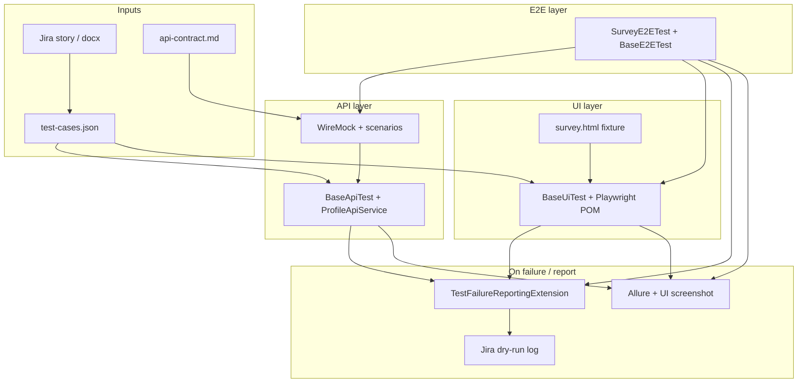

# TestProject — AI-Driven Automation Challenge

Mock POC for the profile interest survey: **API-first** tests (WireMock), **UI logic** tests (Playwright + POM), and an **AI-assisted** workflow (prompts, dry-run Jira, Allure).

| Doc | Purpose |
|-----|---------|
| [PROMPTS.md](PROMPTS.md) | Prompts + reviewer corrections |
| [docs/test-cases.json](docs/test-cases.json) | 20 regression cases (TestRail-style) |
| [docs/api-contract.md](docs/api-contract.md) | WireMock API contract |
| [docs/ui-layer.md](docs/ui-layer.md) | Playwright / POM / base classes |
| [docs/ai-jira-integration.md](docs/ai-jira-integration.md) | Failure → Jira pipeline |
| [docs/mcp-setup.md](docs/mcp-setup.md) · [docs/jira-mcp-workflow.md](docs/jira-mcp-workflow.md) | Jira MCP (optional; templates in repo) |
| [AI-STRATEGY.md](AI-STRATEGY.md) | Scaling pattern to ads |

---

## Architecture overview



| Layer | Technology | Role |
|-------|------------|------|
| API | Spring + WireMock + Rest Assured | Profile create, onboarding, preferences, recommendations |
| UI | Playwright + `ui.pom` | Business logic on local HTML (no WireMock in context) |
| E2E | `E2eTestConfig` | API + UI when both needed (`BaseE2ETest`) |
| Reporting | `helpers` + Allure | Fail → LLM stub → Jira JSON; HTML report |
| CI | GitHub Actions | JUnit Checks; Allure → Pages on `main` |

Flat packages: `api`, `ui`, `e2e`, `configs`, `helpers`, `common`.

### Packages

| Package | Role |
|---------|------|
| `common` | `Constants` (HTTP, tags, survey rules, API paths) |
| `configs` | `ApiProperties` → WireMock base URL |
| `api` | `ApiTestConfig`, `WireMockStubs`, `RestClient`, services |
| `api.tests` | `BaseApiTest`, `ProfileOnboardingApiTest`, `VodPreferencesApiTest`, `RecommendationsApiTest` |
| `ui` | `UiTestConfig` (Playwright only) |
| `ui.tests` | `BaseUiTest`, `AbstractPlaywrightSupport`, `SurveyFlowUiTest` |
| `e2e.tests` | `BaseE2ETest`, `SurveyE2ETest` (Playwright + API) |
| `helpers` | Failure reporting + unit tests for pipeline |

---

## AI workflow (stages 1–3)

| Stage | Goal | Artifacts |
|-------|------|-----------|
| **1** | Test cases from AC | `docs/test-cases.json` — [jira-ac-to-testcases.md](prompts/jira-ac-to-testcases.md) |
| **2** | Automate API + UI | Java tests — [jira-ac-to-java-tests.md](prompts/jira-ac-to-java-tests.md) |
| **3** | Fail → bug report | `helpers/*` — [test-failure-to-jira-bug.md](prompts/test-failure-to-jira-bug.md) |

1. User Story or Jira MCP (when configured) → update `test-cases.json` (review: [PROMPTS.md](PROMPTS.md)). This POC used docx/`LOCAL-SURVEY` fallback.
2. Generate/update tests from JSON + `api-contract.md`.
3. `./gradlew regressionTest` or `apiTest` / `uiTest` / `e2eTest`.
4. On failure: dry-run Jira JSON; Allure locally for UI screenshots.

---

## Traceability

| `test-cases.json` | In code / Allure |
|-------------------|------------------|
| `jiraKey` | `@Epic("LOCAL-SURVEY")` |
| `layer` | `@Feature("api")` / `"ui"` / `"e2e"` |
| `acRef` | `@Story("AC-2")` |
| `id` | `@Description("testCaseId: …")`, `@DisplayName` |
| `expectedResult` | Asserted behaviour (see `notes` → test method) |
| `automationCandidate` | `true` when automated in repo |

### API coverage (high level)

| AC | Class | Focus |
|----|-------|--------|
| AC-1 | `ProfileOnboardingApiTest` | `surveyRequired` once |
| AC-5 | `VodPreferencesApiTest` | Exact `genreIds` / `movieIds` (verify + GET) |
| AC-4, AC-6 | `RecommendationsApiTest` | Skip → default; WireMock scenario default→personalized after save |

### UI coverage

`SurveyFlowUiTest` — Next by genre count (0–4), movies step, 5 movies, skip. See [docs/ui-layer.md](docs/ui-layer.md).

### E2E coverage

`SurveyE2ETest` on `BaseE2ETest` — browser survey path + WireMock API in one test:

| Case | Method | Flow |
|------|--------|------|
| E2E-01 | `completeSurveyInBrowser_thenApiReflectsPersonalizedRecommendations` | GET default → UI 3 genres + 5 movies → POST prefs → GET personalized |
| E2E-02 | `skipSurveyInBrowser_thenApiReturnsDefaultRecommendations` | UI Skip → POST skip → GET default |

Run: `./gradlew e2eTest`. Fixture does not HTTP-post to backend; test submits preferences via API after UI (documented in class javadoc).

### Helper tests (full `test` only)

`FailureContextFactoryTest`, `ReportingPipelineTest` — infrastructure; not in `apiTest` / `uiTest` / `e2eTest` (run via `./gradlew test` or `regressionTest` for `ReportingPipelineTest`).

---

## POC limitations

| Topic | In POC | Not covered |
|-------|--------|-------------|
| Backend | WireMock (+ scenarios) | Real services |
| AC-1 | API onboarding mock | Browser auto-show on real app |
| UI | `fixtures/survey.html` | Production UI |
| Jira / LLM | Dry-run / stub | Live create / OpenAI |
| UI asserts | enabled/disabled, steps | Layout, colors |
| CI | JUnit Checks + Allure on GitHub Pages (`main` only) | Allure on PR runs (artifact only) |

---

## Run tests

```bash
export JAVA_HOME=$(/usr/libexec/java_home -v 17)
```

| Goal | Command |
|------|---------|
| API | `./gradlew apiTest` |
| UI | `./gradlew playwrightInstall uiTest` |
| Regression | `./gradlew regressionTest` |
| E2E | `./gradlew playwrightInstall e2eTest` |
| Smoke | `./gradlew smokeTest` |
| API + UI tasks | `./gradlew layeredTest --parallel` |
| Everything | `./gradlew test` |

### Allure (local)

```bash
./gradlew regressionTest allureReport
./gradlew allureServe
```

Report: `build/reports/allure-report/allureReport/index.html` (cleaned before each `allureReport`).

### Failure reporting

Default `reporting.onFailure=true`. Disable: `./gradlew test -Dreporting.onFailure=false`. Details: [docs/ai-jira-integration.md](docs/ai-jira-integration.md).

---

## CI (GitHub Actions)

[`.github/workflows/tests.yml`](.github/workflows/tests.yml) — Java 17, `ubuntu-latest`.

| Trigger | Runs |
|---------|------|
| Push / PR → `main` | `apiTest` |
| Manual **Run workflow** | Choose suite: `api`, `ui`, `e2e`, `smoke`, `regression`, `all` |

**Checks:** JUnit summary in the Actions tab.  
**Allure:** generated after every run (`allureReport`), even when tests fail.

| Where | When |
|-------|------|
| [GitHub Pages](https://docs.github.com/en/pages/getting-started-with-github-pages/configuring-a-publishing-source-for-your-github-pages-site#publishing-with-a-custom-github-actions-workflow) | Push or manual run on **`main`** only (not PRs) |
| Workflow **Artifacts** → `allure-report` | Every run (incl. PRs), kept 14 days |

### One-time repo setup (Pages)

1. **Settings → Pages → Build and deployment → Source:** `GitHub Actions`
2. Push to `main` or run workflow manually with suite `regression` / `all` for a full report
3. Open: `https://<org>.github.io/<repo>/` (also linked from the `github-pages` environment after deploy)

CI uses `-Dreporting.onFailure=false`.

---

## Tags

| Tag | Used for |
|-----|----------|
| `api` | `apiTest` |
| `ui` | `uiTest` |
| `regression` | `regressionTest` (includes `@Tag(regression)` on API, UI, E2E classes) |
| `smoke` | `smokeTest` |
| `e2e` | `e2eTest` |
| `reporting` | Helper pipeline test |

HTTP codes: `Constants.Http.OK`, `BAD_REQUEST`, `NOT_FOUND`.

---

## Troubleshooting — Playwright (macOS)

`TargetClosedError` / `SEGV_ACCERR`:

1. Java 17: `export JAVA_HOME=$(/usr/libexec/java_home -v 17)`
2. `./gradlew playwrightInstall uiTest`
3. `rm -rf ~/Library/Caches/ms-playwright/ && ./gradlew playwrightInstall`
4. Headed debug: `./gradlew uiTest -Dui.headless=false`
5. Apple Silicon: arm64 JDK
6. API only: `./gradlew apiTest` or `./gradlew test -DskipUiTests=true`
