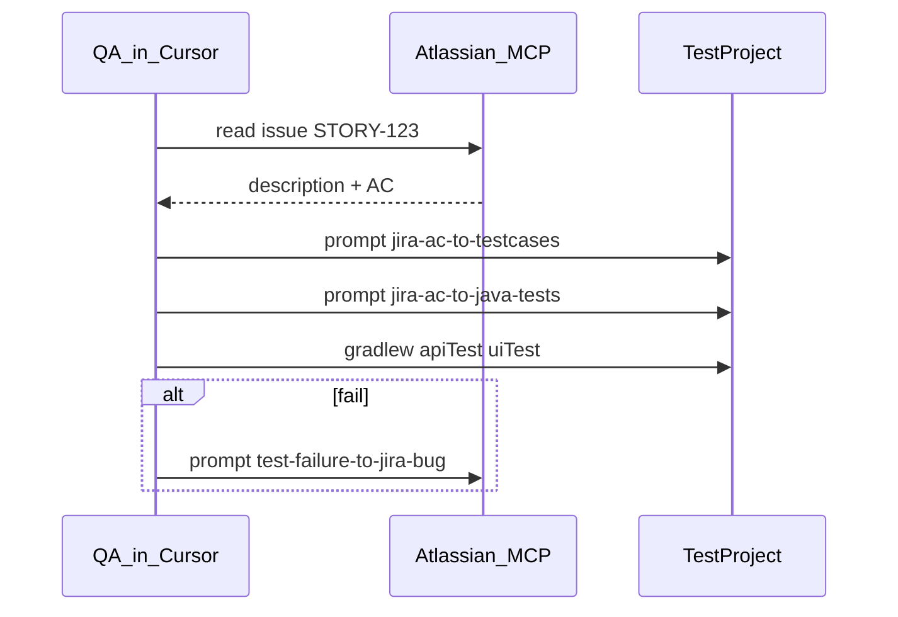

# Atlassian MCP setup (Cursor)

Optional. Required only if you want AI to **read Jira issues** and **create Bugs** from this repo.

This POC works without MCP using `LOCAL-SURVEY` in [`test-cases.json`](test-cases.json).

## What MCP enables

| Step | Prompt file |
|------|-------------|
| Jira issue → test cases JSON | [`prompts/jira-ac-to-testcases.md`](../prompts/jira-ac-to-testcases.md) |
| JSON → Java tests | [`prompts/jira-ac-to-java-tests.md`](../prompts/jira-ac-to-java-tests.md) |
| Failed test → Jira Bug | [`prompts/test-failure-to-jira-bug.md`](../prompts/test-failure-to-jira-bug.md) |

## Setup (Atlassian Rovo MCP)

1. Atlassian Cloud site with Jira Software and API access for your user.
2. Create an [API token](https://id.atlassian.com/manage-profile/security/api-tokens) (for some MCP setups).
3. In Cursor: **Settings → MCP → Add server** (follow current [Atlassian Rovo MCP](https://www.atlassian.com/platform/remote-mcp-server) docs).
4. Example shape for `~/.cursor/mcp.json` (names vary by Atlassian release — adjust to official template):

```json
{
  "mcpServers": {
    "atlassian": {
      "command": "npx",
      "args": ["-y", "@atlassian/rovo-mcp-server"],
      "env": {
        "ATLASSIAN_SITE_URL": "https://your-domain.atlassian.net",
        "ATLASSIAN_EMAIL": "you@example.com",
        "ATLASSIAN_API_TOKEN": "use-env-or-secret-store"
      }
    }
  }
}
```

Do **not** commit tokens. Use environment variables or Cursor secret storage.

5. Restart Cursor; confirm the server is green under **Tools & MCP**.
6. In chat, ask: `Get Jira issue LOCAL-SURVEY` (or your real key) to verify.

## Workflow in this repo



## Fallback without MCP

1. Paste User Story / AC from Jira or docx into Cursor.
2. Set `jiraKey` in `docs/test-cases.json` manually.
3. Use [`prompts/jira-ac-to-java-tests.md`](../prompts/jira-ac-to-java-tests.md).
4. On failure: Java dry-run via `helpers` (`jira.dryRun=true`) or paste logs into `test-failure-to-jira-bug.md` after fixing locally.

## Java-side Jira (no MCP)

See [`.env.example`](../.env.example) and [`docs/ai-jira-integration.md`](ai-jira-integration.md).

Live `JiraIssuePublisher` is not implemented in POC; default is dry-run log only.
